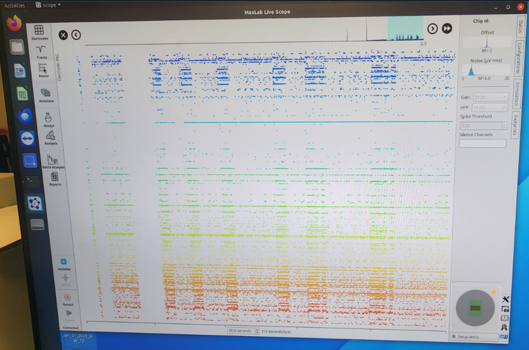
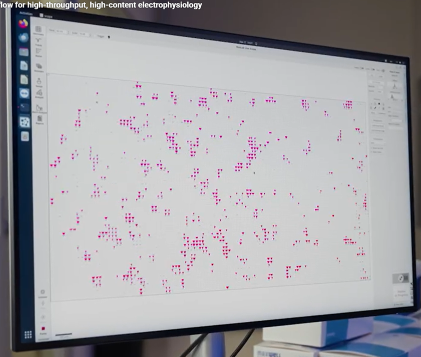
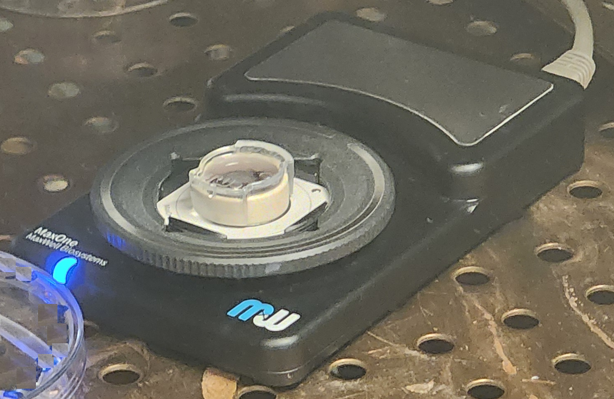
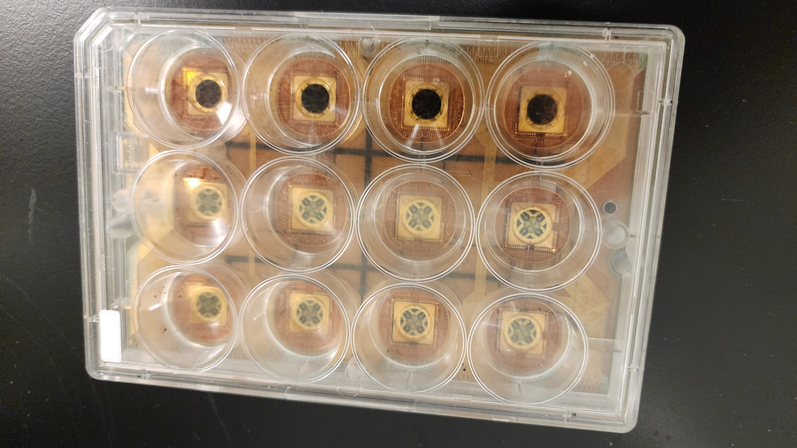
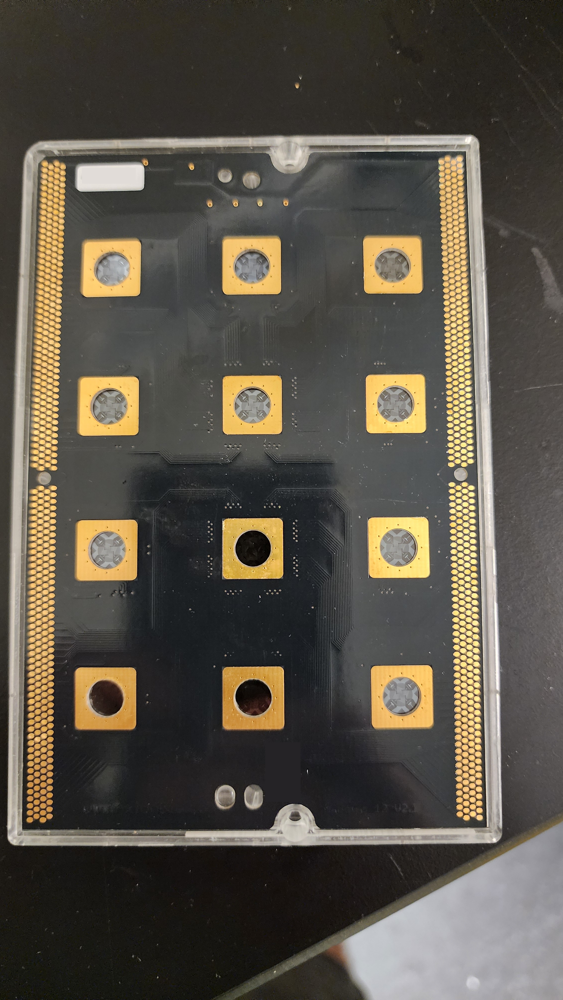

# neuro-ml
neuro machine learning

Website of this README.md file https://hpssjellis.github.io/neuro-ml/

# Project Proposal: Student-Designed Closed-Loop Electrophysiology Experiments Using High-Density Microelectrode Arrays

## Executive Summary

This project proposes a structured collaboration between secondary-school students and a neuroscience research laboratory using the MaxWell Biosystems **MaxOne High-Density Microelectrode Array (HD-MEA)** platform. The objective is to enable students to design, implement, and analyze quantitatively defined closed-loop electrophysiology experiments under laboratory supervision.

Students will develop **spatial stimulation geometries** and **real-time reinforcement algorithms** for cultured human induced pluripotent stem cell (iPSC)-derived neural networks. The scientific objective is to determine how spatiotemporal electrical stimulation influences neural plasticity, functional connectivity, and adaptive network behavior.

A key feature of the program is a **three-year research pipeline** that aligns with the biological time required for neural cultures while providing students with meaningful experimental feedback during every academic year.

## Scientific Objective

Determine whether closed-loop electrical reinforcement modifies the electrophysiological behavior of cultured human neural networks recorded on a **26,400-electrode HD-MEA**.

The primary hypothesis is that contingent reinforcement following predefined network responses will produce measurable changes in response probability, spike timing, network connectivity, and stimulus-response performance compared with open-loop stimulation controls.

## Experimental Platform

The MaxOne HD-MEA enables simultaneous recording and stimulation across a high-density electrode array. A subset of electrodes can be dynamically routed for stimulation and recording, allowing students to design complex **spatial stimulation fields**.

Students will investigate stimulation geometries such as:

- Concentric rings
- Radial spokes
- Directional gradients
- Opposing hemispheres
- Rotating stimulation fields
- Moving wavefronts
- Localized reward fields

The educational objective is to give students ownership of experimental design, while the laboratory objective is to develop a high-throughput platform for systematic exploration of spatiotemporal reinforcement strategies in living neural networks.

## Operational Definition of Learning

Learning will be defined operationally as a change in measurable electrophysiological metrics relative to baseline and control conditions.

**Primary outcome measures**

- Evoked response probability
- Spike latency following stimulation
- Population burst frequency
- Functional connectivity inferred from spike-train correlations
- Information transfer between stimulated and output regions
- Stability of responses across repeated trials

## Reinforcement Protocol

Students will implement programmable reinforcement schedules using charge-balanced biphasic stimulation pulses.

**Example experimental paradigm**

- Deliver a spatially defined stimulation pattern.
- Evaluate network activity within a predefined post-stimulus window (for example, **5–20 ms**).
- Classify responses using predefined electrophysiological criteria.
- Deliver contingent reinforcement following successful responses.
- Compare reinforcement schedules across experimental conditions.

Reinforcement frequencies (for example, **30 Hz versus 2 Hz**) are treated as **experimental variables** rather than assumed biological learning mechanisms and will be evaluated empirically.

## Three-Year Research Pipeline

### Year 1: Rapid Stimulation Mapping

Students focus on **high-throughput experimental design and rapid iteration** using existing laboratory cultures that have completed their primary research purpose but remain electrophysiologically active.

The experimental cycle is intentionally short:

1. Design a stimulation pattern.
2. Apply a **5–10 minute closed-loop protocol**.
3. Record electrophysiological responses.
4. Analyze the data.
5. Modify the stimulation program.

Because experiments can be completed quickly, students can test multiple variables within a single school term, including spatial geometry, pulse timing, reinforcement contingency, and response thresholds.

The laboratory can schedule **monthly experimental rounds**, allowing students to receive rapid feedback and refine their algorithms throughout the year.

### Year 2: Longitudinal Plasticity Experiments

Students begin experiments on cultures prepared specifically for the educational research program.

Because cultures are available from the beginning of the academic year, students can initiate stimulation immediately and follow the same network over weeks and months.

Research questions include:

- Positive versus negative reinforcement schedules
- Acquisition of stimulus-response behavior
- Retention of learned responses
- Changes in functional connectivity
- Long-term stability of trained networks

This phase generates the first **longitudinal plasticity datasets**.

### Year 3: Next-Generation Experimental Design

Students analyze the combined dataset from previous cohorts and design more sophisticated experiments.

Research directions may include:

- Competing stimulation pathways
- Spatial reward-field optimization
- Adaptive reinforcement algorithms
- Multi-region input/output routing
- Transfer of learned responses between network regions
- Automated optimization of stimulation geometries

The emphasis shifts from parameter exploration to **hypothesis-driven experimental design**.

## Student Research Roles

### Experimental Design Team

- Design spatial stimulation geometries
- Define input and output regions
- Specify reinforcement contingencies
- Develop experimental controls

### Computational Analysis Team

- Process spike trains
- Detect evoked responses
- Compute connectivity metrics
- Perform statistical analyses

### Software Engineering Team

- Implement real-time closed-loop control
- Integrate recording and stimulation pipelines
- Validate timing precision
- Log experimental metadata

### Laboratory Team (Research Supervision)

- Cell culture and differentiation
- Sterile handling
- Electrode preparation
- Hardware operation
- Experimental oversight

## Experimental Controls

A scientifically valid comparison requires parallel control conditions.

### Open-Loop Control

Identical stimulation delivered without contingent reinforcement.

### Random Reinforcement Control

Reinforcement delivered with identical frequency but independent of network output.

### Sham Reinforcement Control

Detection algorithms executed without delivery of reinforcement pulses.

These controls distinguish reinforcement-dependent plasticity from spontaneous network drift and stimulation-induced adaptation.

## Data Analysis

**Primary analysis**

- Within-network comparison before versus after reinforcement
- Between-group comparison across reinforcement conditions

**Statistical methods**

- Mixed-effects models for repeated measurements
- Permutation tests for connectivity changes
- Survival analysis of response persistence
- False-discovery-rate correction for multiple comparisons

## Ethics and Laboratory Oversight

All cell culture, stem-cell differentiation, and electrophysiology experiments will be conducted under the supervision of the host research laboratory and in accordance with institutional biosafety and ethics approvals.

Students will participate in approved activities including experimental design, software development, stimulation-program development, quantitative data analysis, and scientific interpretation. Biological materials will remain under laboratory control at all times.

## Expected Deliverables

- A validated closed-loop stimulation software framework
- A library of spatial stimulation geometries
- Standardized reinforcement protocols
- An anonymized electrophysiology dataset
- A statistical comparison of reinforcement and control conditions
- Student-authored scientific posters, reports, and manuscript contributions

This program creates a sustainable research pipeline in which each student cohort contributes to the next generation of bio-hybrid electrophysiology experiments, while maintaining rigorous experimental design, quantitative analysis, ethical oversight, and continuity across multiple years of investigation.

## maxaOne Time Series 

## maxaOne live array view 

## MaxOne sample data tray

## Old Sensor 12-64x64-neuro-electrodes-front.png

## Old Sensor 12-64x64-neuro-electrodes-back.png

     

# Gemini Generated images of the possible view from the MaxOne live array interface

## possibly-view01.jpg

Generated using Gemini possibly reproduceable using this prompt and the maxone live array [media/sensor-array.png](media/sensor-array.png) as an input.

Prompt: and insert above image [media/sensor-array.png](media/sensor-array.png) as attached input.

A detailed photograph of a large, modern computer monitor displaying the "MaxLab Live" high-content electrophysiology software interface, based on the layout seen in image_0.png. The screen shows the central sensor grid canvas with the original background of scattered, natural magenta neural activity clusters. Overlaid centrally on the grid is a precise, large circular arrangement of exactly 32 crisp blue stimulation points. Within this circle, four specific, non-adjacent blue points are distinctly colored vibrant green, indicating active stimulation. A prominent 4x3 grid of thin, solid black lines is overlaid across the entire sensor area, creating 12 distinct rectangular analysis zones. The fourth quadrant (bottom-right) of this grid is intensely highlighted, containing a significantly denser cluster of bright red neural activity dots, signifying a specific region of trained, heightened activation in response to the stimulation. All original surrounding software UI elements, toolbars, the Ubuntu launcher on the left, and the text "Flow for high-throughput, high-content electrophysiology" in the upper-left corner are preserved and sharp. The monitor is positioned in a modern lab setting, with blurred out-of-focus lab equipment in the background. The perspective is a three-quarter view of the screen.

That generated the following image

## possibly-view02.jpg

